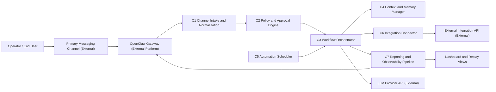

# Honeybucket High-Level Design (HLD)

Last updated: 2026-02-22  
Audience: External stakeholders  
Scope: Month-1 MVP (February 22, 2026 to March 22, 2026)

## Executive summary

Honeybucket is a personal AI assistant operated through OpenClaw with a single primary messaging channel, strict safety controls, and measurable workflow outcomes. This HLD defines the system context, major components, external interfaces, and delivery constraints required to meet month-1 goals.

## 1) Goals and success criteria

Honeybucket must satisfy the following month-1 outcomes:

- Reliable gateway operation with 7 consecutive days of no critical incident.
- One primary messaging channel operating end-to-end for real user tasks.
- Safety controls enforced via pairing and approval gates.
- At least 10 real tasks completed with at least 80 percent first-attempt success.
- Daily trend reporting delivered at least 5 days per week.

## 2) Scope boundaries

| In scope (month 1) | Out of scope (month 1) |
|---|---|
| Single operator and one primary messaging channel | Multi-channel production rollout |
| OpenClaw-based assistant orchestration | Custom UI platform buildout |
| Safety policy enforcement (pairing, approval, allowlists) | Enterprise IAM/SSO and compliance programs |
| Four core workflows plus dashboard replay view | Multi-agent marketplace and advanced orchestration |
| One external high-value integration | Multiple complex integrations |

## 3) System context and boundary

Honeybucket is designed as an orchestration layer around OpenClaw and channel/provider dependencies. External systems are modeled only at contract boundary level.

## 4) Component model

| ID | Component | Responsibility | Inputs | Outputs |
|---|---|---|---|---|
| C1 | Channel Intake and Normalization | Convert channel events into normalized task requests | Channel/OpenClaw message events | Normalized `TaskRequest` payload |
| C2 | Policy and Approval Engine | Enforce pairing and approval policy before execution | `TaskRequest`, policy config, pair status | `PolicyDecision` and optional approval record |
| C3 | Workflow Orchestrator | Route approved work to the correct workflow and manage execution state | Approved request, workflow definitions, context | `WorkflowRun` status and outputs |
| C4 | Context and Memory Manager | Read/write memory, templates, and historical context for workflows | Workflow context requests and memory updates | Context bundles and persisted memory changes |
| C5 | Automation Scheduler | Trigger recurring workflows on schedule | Schedule definitions and clock events | Scheduled workflow execution requests |
| C6 | Integration Connector | Call one high-value external integration with retries and validation | Integration requests from C3 | Integration responses and normalized errors |
| C7 | Reporting and Observability Pipeline | Emit operational events, dashboard snapshots, and replay timeline | Execution events, approval events, health events | Metrics, replay artifacts, daily reports |

## 5) External interface boundaries

| Interface ID | External system | Boundary contract | Security/auth expectation | Failure handling expectation |
|---|---|---|---|---|
| I1 | OpenClaw Gateway | Message ingress/egress and audit queue APIs | Paired identities and approval workflow enabled | Queue or reject when gateway is degraded |
| I2 | Primary Messaging Channel | Inbound user messages and outbound assistant responses | Channel credential/token managed as secret | Retry send on transient failures, alert on repeated failure |
| I3 | LLM Provider API | Prompt/response inference calls | Provider API key with scoped permissions | Timeout and bounded retry with fallback message |
| I4 | Optional Web Search Provider | Search queries for enrichment workflows | Optional key (`OPENCLAW_WEBSEARCH_API_KEY`) | Degrade gracefully when unavailable |
| I5 | High-value External Integration API | Read/write calls for selected integration | Least-privilege credentials and input validation | Circuit-breaker behavior after repeated auth or rate-limit errors |

## 6) Primary operational flows

### Flow F1: Interactive task (happy path)

1. User sends request in primary channel.
2. C1 normalizes message to `TaskRequest`.
3. C2 evaluates policy and returns `allow`.
4. C3 executes selected workflow with context from C4.
5. C3 posts result back through OpenClaw/channel.
6. C7 records execution and updates status surfaces.

### Flow F2: Approval-gated task

1. C2 classifies request as `approval_required`.
2. Approval record is created and surfaced via OpenClaw audit queue.
3. Execution continues only after approval action is received.
4. C7 records approval latency and disposition for governance review.

### Flow F3: Scheduled daily trend report

1. C5 triggers at scheduled local time (08:30).
2. C3 runs trend workflow using event history from C7 and context from C4.
3. Final report is delivered through configured channel output path.
4. C7 captures completion metrics and report delivery status.

### Flow F4: Dashboard and replay

1. C7 aggregates latest system health and workflow outcomes.
2. Replay view exposes prior 7 days of event timeline.
3. Operator reviews open approvals, failures, and trend movement.

## 7) Non-functional requirements and constraints

| Category | Target | Architecture implication |
|---|---|---|
| Reliability | 7-day stable operation with 0 critical incidents | Health checks, bounded retries, clear escalation paths |
| Task quality | At least 80 percent first-attempt success | Strong workflow templates and context hygiene |
| Responsiveness | Typical routine completion at or under 5 minutes | Timeout budgets and deterministic routing |
| Security | 100 percent unpaired/risky actions blocked or approval-gated | Policy-first execution with explicit deny path |
| Observability | Dashboard replay for prior 7 days | Structured event schema and retention policy |
| Operability | Single-operator manageable runbook | Clear runbook actions and low manual overhead |

## 8) Risks and mitigation summary

| Risk | Impact | Mitigation in design |
|---|---|---|
| Channel instability or auth expiration | User-facing outages | Health checks, weekly re-auth validation, retry with alerts |
| Overly broad command/path permissions | Safety breach | Policy enforcement through C2 plus periodic audit review |
| External provider latency/timeouts | Slow or failed responses | Timeout budgets, transient retry policy, fallback responses |
| Data quality drift in trend reporting | Misleading daily signals | Input validation and baseline checks in C3/C7 |
| Scope creep across month-1 timeline | Delivery miss | Explicit in/out scope boundaries and weekly gate reviews |

## 9) Rollout narrative (month-1)

- Week 1 (Feb 22 to Feb 28, 2026): Stand up OpenClaw connectivity, channel path, and C1/C2 safety baseline.
- Week 2 (Mar 1 to Mar 7, 2026): Stabilize C3/C4 workflows and output templates across core use cases.
- Week 3 (Mar 8 to Mar 14, 2026): Add C5 automation, C6 external integration, and C7 dashboard replay.
- Week 4 (Mar 15 to Mar 21, 2026): Hardening, reliability burn-in, and launch-readiness verification.

## 10) Assumptions and open decisions

### Assumptions

- One primary messaging channel is sufficient for month-1 outcomes.
- External systems are represented by contracts only, not inferred internals.
- Single-operator support model remains in place through month 1.

### Open decisions

Open architecture choices are tracked in `docs/architecture/architecture-decisions.md` and include provider selection, integration priority, and event storage strategy.
