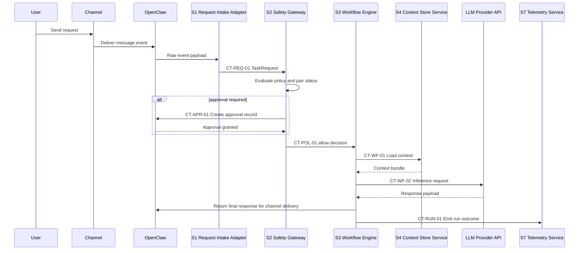
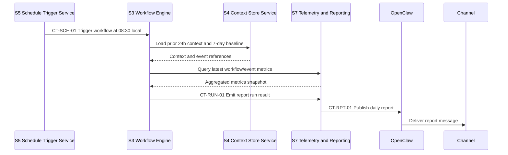

# Honeybucket Low-Level Design (LLD)

Last updated: 2026-02-22  
Audience: Delivery and operations stakeholders  
Scope: Month-1 MVP implementation detail

## 1) Purpose

This LLD translates the HLD component model into implementable subsystem contracts, critical path sequences, data structures, and operations hooks while keeping external dependencies at interface boundary level only.

## 2) Traceability matrix (LLD to HLD)

| LLD subsystem | Parent HLD component | Purpose |
|---|---|---|
| S1 Request Intake Adapter | C1 Channel Intake and Normalization | Parse inbound events and produce normalized task requests |
| S2 Safety Gateway | C2 Policy and Approval Engine | Enforce pairing, command/path policy, and approval gating |
| S3 Workflow Engine | C3 Workflow Orchestrator | Execute workflows and manage run lifecycle |
| S4 Context Store Service | C4 Context and Memory Manager | Provide context retrieval and memory persistence |
| S5 Schedule Trigger Service | C5 Automation Scheduler | Trigger scheduled workflows and track trigger outcomes |
| S6 External Integration Driver | C6 Integration Connector | Invoke selected external integration with retries and normalization |
| S7 Telemetry and Reporting Service | C7 Reporting and Observability Pipeline | Emit event logs, dashboard snapshots, and trend reports |

## 3) Subsystem responsibilities

| Subsystem | Parent HLD component | Responsibilities | Key dependencies |
|---|---|---|---|
| S1 Request Intake Adapter | C1 | Validate message envelope, normalize user intent payload, attach request metadata | OpenClaw message events, channel metadata |
| S2 Safety Gateway | C2 | Evaluate policy, check pair status, create and resolve approval records | Policy config, pair list, audit queue |
| S3 Workflow Engine | C3 | Select workflow template, execute steps, gather outputs, return status | LLM provider interface, S4, S6 |
| S4 Context Store Service | C4 | Load context bundles, update memory, enforce retention and consistency | Workspace files, memory templates |
| S5 Schedule Trigger Service | C5 | Trigger recurring runs, prevent duplicate trigger collisions, emit run metadata | Scheduler definitions, S3, S7 |
| S6 External Integration Driver | C6 | Validate integration requests, call external API, normalize failures | External integration API credentials |
| S7 Telemetry and Reporting Service | C7 | Store event logs, build replay timeline, publish status/report views | S1-S6 events, dashboard output path |

## 4) Contract catalog

| Contract ID | Producer -> Consumer | Input | Output | Error classes | Timeout | Retry policy |
|---|---|---|---|---|---|---|
| CT-REQ-01 | S1 -> S2 | Raw message event (`messageId`, `userId`, `channelId`, `timestamp`, `text`) | `TaskRequest` (`requestId`, `intent`, `args`, `riskHints`) | `E_INVALID_MESSAGE`, `E_PARSE_FAIL` | 2s | No retry; reject and log |
| CT-POL-01 | S2 -> S3 | `TaskRequest` plus policy context | `PolicyDecision` (`allow`/`deny`/`approval_required`, reason, `approvalId?`) | `E_POLICY_CONFIG`, `E_PAIRING_STATE` | 1s | No retry; fail closed |
| CT-APR-01 | S2 -> OpenClaw audit queue | Approval payload (`requestId`, action summary, risk level) | `approvalId`, status | `E_AUDIT_UNAVAILABLE` | 3s | Retry up to 2 with backoff |
| CT-WF-01 | S3 -> S4 | Context fetch request (`requestId`, workflowId, context keys) | Context bundle and memory pointers | `E_CONTEXT_NOT_FOUND`, `E_CONTEXT_IO` | 2s | Retry once on IO error |
| CT-WF-02 | S3 -> LLM Provider API | Prompt payload and model parameters | Model response and usage metadata | `E_PROVIDER_TIMEOUT`, `E_PROVIDER_RATE_LIMIT`, `E_PROVIDER_AUTH` | 30s | Retry up to 2 for timeout/rate limit |
| CT-INT-01 | S3 -> S6 | Integration request payload (`integrationId`, action, params) | Integration response or normalized error | `E_INTEGRATION_AUTH`, `E_INTEGRATION_RATE_LIMIT`, `E_INTEGRATION_BAD_REQUEST` | 20s | Retry once except bad request/auth |
| CT-RUN-01 | S3 -> S7 | Workflow run event (`runId`, stage, status, latencyMs, errorCode?`) | Persisted event record and dashboard update signal | `E_TELEMETRY_IO` | 2s | Retry once; queue if unavailable |
| CT-SCH-01 | S5 -> S3 | Scheduled trigger (`scheduleId`, `runAt`, `workflowId`) | Scheduled `WorkflowRun` record | `E_DUPLICATE_TRIGGER`, `E_SCHEDULER_STATE` | 2s | Retry once for transient scheduler error |
| CT-RPT-01 | S7 -> Channel via OpenClaw | Daily report payload and destination metadata | Delivery status (`sent`, `failed`) | `E_CHANNEL_SEND_FAIL`, `E_GATEWAY_UNAVAILABLE` | 10s | Retry up to 3 with escalation |

## 5) Critical path sequences

### Sequence A: Interactive request with optional approval

### Sequence B: Daily trend report automation

## 6) State and data model

| Entity | Required fields | Source subsystem | Retention target | Notes |
|---|---|---|---|---|
| `TaskRequest` | `requestId`, `messageId`, `userId`, `intent`, `createdAt`, `riskHints` | S1 | 30 days | Canonical inbound request |
| `PolicyDecision` | `requestId`, `decision`, `reason`, `policyVersion`, `evaluatedAt` | S2 | 90 days | Governance and audit trace |
| `ApprovalRecord` | `approvalId`, `requestId`, `status`, `actor`, `updatedAt` | S2/OpenClaw | 90 days | Includes latency to decision |
| `WorkflowRun` | `runId`, `requestId?`, `workflowId`, `status`, `startedAt`, `endedAt`, `errorCode?` | S3 | 90 days | Core execution telemetry |
| `MemoryEntry` | `entryId`, `scope`, `content`, `tags`, `updatedAt` | S4 | Rolling with weekly hygiene | Supports context quality |
| `EventLog` | `eventId`, `type`, `severity`, `component`, `timestamp`, `payloadRef` | S7 | 90 days | Powers replay and incident review |
| `DailyTrendReport` | `reportDate`, `topUsers`, `keyUpdates`, `trendSignals`, `actions` | S7 | 180 days | Output artifact for daily review |

## 7) Config and secrets handling

| Key | Required | Owner subsystem | Source | Validation | Failure mode |
|---|---|---|---|---|---|
| `OPENCLAW_API_KEY` | Yes | S1/S2/S7 integration points | Secret store or env | Non-empty and valid auth handshake | Block startup and alert |
| `OPENCLAW_WEBSEARCH_API_KEY` | No | S3 optional enrichment workflows | Secret store or env | If present, validate provider reachability | Disable enrichment path |
| `PRIMARY_CHANNEL_TOKEN` | Yes | S1/S7 channel send/receive | Secret store or env | Token validity check at startup | Enter degraded mode |
| `LLM_PROVIDER_KEY` | Yes | S3 inference calls | Secret store or env | Auth probe against provider API | Fail workflow with actionable error |
| `INTEGRATION_API_KEY` | Week-3 required | S6 | Secret store or env | Scope and auth validation | Disable integration workflow |

## 8) Failure handling and retry matrix

| Failure class | Detection point | Auto action | Max retry | Escalation |
|---|---|---|---|---|
| `E_GATEWAY_UNAVAILABLE` | OpenClaw health check or send failure | Queue outbound response/report if possible | 3 | Raise operator alert if still failing |
| `E_PROVIDER_TIMEOUT` | S3 provider call timeout | Retry with backoff and fallback message | 2 | Log incident and include in daily report |
| `E_PROVIDER_AUTH` | Provider auth response | Stop retry, mark run failed | 0 | Immediate credentials check task |
| `E_CONTEXT_IO` | S4 context read/write errors | Retry once, then fail run | 1 | Create ops item for storage path check |
| `E_INTEGRATION_RATE_LIMIT` | S6 response code | Retry once with delay | 1 | Degrade integration and notify |
| `E_POLICY_CONFIG` | S2 policy evaluation | Fail closed and deny request | 0 | Immediate policy review required |

## 9) Observability and operations hooks

### Required metrics

- `workflow_run_success_rate` (target: at least 0.80)
- `workflow_run_latency_ms_p50` (target: at or below 300000 ms for routine tasks)
- `approval_queue_pending_count`
- `daily_report_delivery_rate` (target: at least 5 successful runs per week)
- `critical_incident_count` (target: 0 during hardening week)

### Required alerts

| Alert | Trigger | Response action |
|---|---|---|
| Gateway degraded | OpenClaw health check fails for 5 minutes | Follow technical runbook restart/health verification |
| Approval backlog | Pending approvals older than 30 minutes | Manual triage and queue review |
| Daily report missed | Scheduled report not delivered by 09:00 local | Re-run report and log failure class |
| Success rate drop | 24h success rate falls below 0.80 | Review failed runs and patch workflow template |

## 10) Testability and acceptance scenarios

1. Interactive request path: verify S1 -> S2 -> S3 -> S7 with successful response delivery.
2. Approval gate path: verify risky request remains blocked until explicit approval action.
3. Scheduler path: verify daily trigger runs once at configured time and delivers report.
4. Retry behavior: inject provider timeout and confirm bounded retries plus fallback handling.
5. Replay coverage: verify seven prior days are visible in timeline output.
6. Policy fail-closed: simulate policy config error and confirm request denial with audit record.

## 11) Open low-level decisions

All unresolved LLD choices are tracked in `docs/architecture/architecture-decisions.md` with owner, date opened, target date, and next action.
